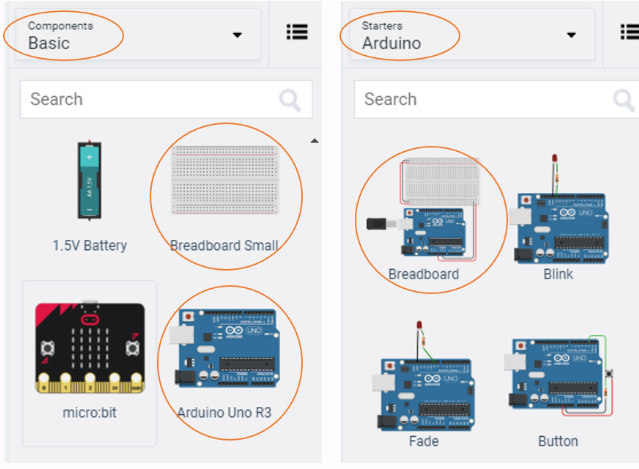
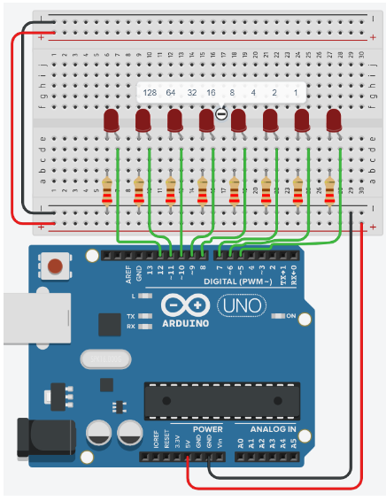
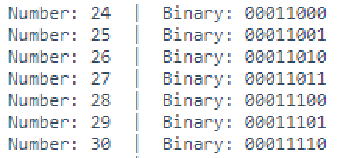

# Introduction

In today’s activity we will study how computers “count”, and we will discuss the idea of binary numbers and binary counting.

We will then connect the Arduino board to 4 LEDs, and see how the computer can count.

> The primary tool for this project will be TinkerCad -> https://www.tinkercad.com


## Binary Counting

Computers count in BINARY, i.e. using ones and zeros. For example, the number 5 in binary is 00000101. How does this work? Here is a chart to explain how the computer uses 8-bits to represent the numbers from 0...255.

Below is a table that show the possible combinations of 4-bit binary numbers and their decimal equivalent.

<table align=center>
<tr>
<td>

|Decimal| Binary| | Decimal| Binary |
|---|---| --- |---|---|
|0  | 00000000  ||16  | 00010000  |
|1  | 00000001  ||32  | 00100001  |
|2  | 00000010  ||64  | 01000000  |
|3  | 00000011  ||66  | 01000010  |
|4  | 00000100  ||100  | 01100100  |
|5  | 00000101  ||156  | 00000101  |
|6  | 00000110  ||176  | 10110000  |
|7  | 00000111  ||184  | 10111000  |
|8  | 00001000  ||200  | 11001000  |
|9  | 00001001  ||201 | 11001001  |
|10 | 00001010  ||212 | 11010100  |
|11 | 00001011  ||236 | 11101100  |
|12 | 00001100  ||237 |  11101101 |
|13 | 00001101  ||239 | 11101111  |
|14 | 00001110  ||240 | 11110000  |
|15 | 00001111  ||255 | 11111111 |

**Bite binary represented here is MSB to LSB*
</td>
</tr>
</table>

## Converting between Decimal <---> Binary
Since binary is a base-2 system, each digit represents an increasing power of 2, with the rightmost digit representing 20 , the next representing 21, then 22, and so on. To determine the decimal representation of a binary number simply take the sum of the products of the binary digits and the powers of 2 which they represent. 

Below are some examples as reminders.

The decimal number `10' is converted to binary form like so:

<p>
   <span class="math display">
      \[
        \begin{matrix}
            2^3 & 2^2 & 2^1 & 2^0\\ \hline
            8 & 4 & 2 & 1 \\
            1 & 0 & 1 & 0
        \end{matrix}
    \]
   </span>
</p>

Alternatively you can achieve the same result this way too: 

\\[ \[(1) \cdot 2^{3}\] + \[(0) \cdot 2^{2}\] + \[(1) \cdot 2^{1}\] + \[(0) \cdot 2^{0}\] \\ \\]

\\[ 1 \cdot 8 + 0 \cdot 4 + 1 \cdot 2 + 0 \cdot 1  \\]

\\[ 1 0 1 0 \\]

So therefore decimal `10' is 1010 in binary form.

The binary number 11011011 is converted to decimal form like so: 

<p>
   <span class="math display">
      \[
        \begin{matrix}
            2^7 & 2^6 & 2^5 & 2^4 & 2^3 & 2^2 & 2^1 & 2^0\\ \hline
            128 & 64 & 32 & 16 & 8 & 4 & 2 & 1 \\
            1 & 1 & 0 & 1 & 1 & 0 & 1 & 1 \\
        \end{matrix}\\
        219 = 128+64+16+8+2+1
    \]
   </span>
</p>

Alternatively you can achieve the same result this way too: 

\\[ [(1) \cdot 2^{7}] + [(1) \cdot 2^{6}] + [(0) \cdot 2^{5}] + [(1) \cdot 2^{4}] + [(1) \cdot 2^{3}] + [(0) \cdot 2^{2}] + [(1) \cdot 2^{1}] + [(1) \cdot 2^{0}] \\]

\\[ [1 \cdot 128] +[1 \cdot 64] + [0 \cdot 32] + [1 \cdot 16]  + [1 \cdot 8] +[0 \cdot 4] + [1 \cdot 2] + [1 \cdot 1]  \\]

\\[ 219 = 128+64+16+8+2+1\\]

## Settting up the Circuit


Once loaded login to TinkerCad and then click on **Circuits** > **Create new Circuit**.

Change the circuit name, located top-left hand side of the screen to **8-bit Binary Counter**, see below:


<div align=center>


</div>

Next you need to add an Arduino Uno and a breadboard that need to be connected together from the 5V and GND pins of the Arduino to the power and ground rails of the breadboard. 

This can be achieved by either selecting the Arduino Uno and the breadboard from **Components** > **Basic** components or by changing **Components** > **Basic** to **Components** > **Starter** and choosing Arduino Uno and the Breadboard starter. Please refer to the image below.

<div align=center>



</div>

If you have chosen the Arduino and breadboard template from the the **Components** > **Starter** then these two components are already connected with a corresponding red 5V line and GND line. 

You will need: 
- 8 x LED, any colour
- 8 x resistor, set at \\(0.22k\Omega\\) or \\(220\Omega\\)

Placing components (refer to image below step by step instructions): 
1.  Place the LEDs so that the **cathode** and **anode** is in row **6** and **7** column **e** respectively. Repeat for the next 7 LEDs with rows **8, 11, 14, 17, 20, 23, 26** as gaps between each LED.
2.  Place the resistors inline with the **Cathode** of the LED so that **terminal 2** is in column **b** and **terminal 1** in the GND rail.
3.  connect a wire from inline with each **Anode** of LED, and connect from left to right of the breadboard, to **Pins 12, 11, 10, 9, 8, 7, 6, 5** in the Arduino Uno.

<div align=center>



</div>

## Programming the Circuit

Once you have completed the circuit you will need to programme the Arduino Uno.  Located above the **Components** click the **Code** > **Text**. Once the sketch has appeared reproduce the following code: 

```C++
void setup()
{

}

void loop()
{

}
```

Now you are ready to set up all the Sketch up as follows. 

```C++
int ledPin[8]={5,6,7,8,9,10,11,12};
char binary[9] ={0,0,0,0,0,0,0,0,'\0'};

void setup()
{

}

void loop()
{

}
```

Line 2, is an array of `char` with a length of 9, notice that at the end the array is `\0`, this is a null terminator so that the when printed to the Serial monitor it only prints the first 8 positions in the array.

Setting up the `void setup()` we will do something a little more efficient to set the `pinMode()` of the `ledPins` array. 

*Important note, arrays start from 0 to n. So `ledPins[1] = 6` and `ledPins[7] = 12`.*

<p>
   <span class="math display">
      \[
 \begin{matrix}
      Index[x] & 0 & 1 & 2 & 3 & 4 & 5  & 6  & 7\\ \hline
      LedPin  Value & 5 & 6 & 7 & 8 & 9 & 10 & 11 & 12 \\
 \end{matrix}
       \]
   </span>
</p>

Line 10, shows the initialisation of a for loop ,`for(int x=0;x<8;x++)`, sets a variable `x` as 0 and while `x` less than 8 increment `x` by 1, so we can repeat the code between the `{}` 8 times. 

So you can see that as `x` starts at 0, `ledPin[x]` will set pin 5 as `OUTPUT`. So therefore `Serial.print(ledPin[x])` outputs the value to the Serial monitor.


```C++
void setup()
{
   Serial.begin(9600);
   
  for(int x=0;x<8;x++)
  {
    pinMode(ledPin[x], OUTPUT);
    Serial.print(ledPin[x]);
    Serial.print(",");
  } 
 
  Serial.println();
}
```

The `void loop()`, function has little code because of the for loop and a user defined function `displayBinary();`.

```C++
void loop()
{
  for (byte counter =0;counter<=255; counter++)
  {
    displayBinary(counter);
    delay(500);
  } 
}
```

> QUESTION:
>
> - Looking at the lines 22 to 26, describe what is happening.

So now lets look at the user defined function `displayBinary();` below. 

*Remember in earlier weeks of the course you looked at the number of bits in different data types? Notice that the expected argument in the `displayBinary(byte numToShow);` is the data type `byte`. So line 31, `for(int i=0; i<8; i++)` iterates over the number bits in one byte. 


```C++
  displayBinary(counter);
  delay(500);
 }
}

void displayBinary(byte numToShow)
{
 for (int i =0;i<8;i++)
 {
   if (bitRead(numToShow, i)==1)
   {
     binary[7-i] = '1';
     digitalWrite(ledPin[i], HIGH);
   }
   else
   {
     binary[7-i] = '0';
     digitalWrite(ledPin[i], LOW);
   }
 }

 Serial.print("Number: ");
 Serial.print(numToShow);
 Serial.print(" | Binary: ");
 Serial.println(String(binary));
}
```

Line 33, `if (bitRead(numToShow, i)==1)` passes the `numToShow` variable to the inbuilt function `bitRead();`. The `if` statement checks to see if the bit `i` is a 1.

Line 35, `binary[7-i] = '1';` sets the value at the index `7-i`.

Line 36, `digitalWrite(ledPin[i], HIGH);` sets the LED at the correct bit position to `HIGH`. 

Therefore line 38, `else` condition is implicitly true when `(bitRead(numToShow, i)==0)`.

Line 40, `binary[7-i] = '0';` sets the value at the index `7-i`. 

Line 41, `digitalWrite(ledPin[i], LOW)`, sets the LED at the correct bit position to `LOW`.

Line 44 to 47, outputs the current number `numToShow` and binary equivalent to the Serial monitor. As seen in image below.

<div align=center>



</div>

Below shows the output you'd expect to see for the decimal number 171.

\bigcirc

<p>
   <span class="math display">
      \[
    \begin{matrix}
        Arduino pins & 12 & 11 & 10 & 9 & 8 & 7 & 6 & 5\\
         LEDs &\circledast & \bigcirc & \circledast & \bigcirc & \circledast & \bigcirc & \circledast & \bigcirc \\
         Binary &1 & 0 & 1 & 0 & 1 & 0 & 1 & 0 \\
    \end{matrix}
       \]
   </span>
</p>

> QUESTIONS:
>
> - Look at the following documentation for `bitRead()` and summaries in your own words what it does:  https://www.arduino.cc/reference/en/language/functions/bits-and-bytes/bitread/
> 
> -  Edit line 2 so that it says `char binary[8] ={0,0,0,0,0,0,0,0};` and then start the simulation. What difference was there from the original output? Once tested return the code on line 2 to `char binary[9] = {0,0,0,0,0,0,0,0,'\0'};`.
>
> - What would the output be on line 47 `Serial.println(String(binary))`, if lines 35 and 40 `binary[7-i]` is changed to `binary[i]`. Test your theory/answer.

## Extension

- Append the circuit to show 9-bits.
- Adjust the code to match the circuit
   -  Increase the arrays length by one on lines 1 and 2
   -  Therefore line 8, `for(int x=0;x<8;x++)`, `x<8` needs to be increase by one to match the changes made on lines 1 and 2.
   -  Line 21, `for (byte counter =0;counter<=255; counter++)` needs to updated to show a range from 0 to a 9-bit number. Use the formula \\((2^9 - 1)\\) to find the value you need.
   -  Adjust line 30  `for (int i =0;i<8;i++)` so that it is the same as line 8.
   -  Finally modify lines 34 and 39 `binary[7-i] = `, `8-i`.  

> QUESTIONS:
>
> Does the cicuit and code output a 9-bit number? 
>
> Reflect on this project, focus on the difficulty of the circuit and code. 

