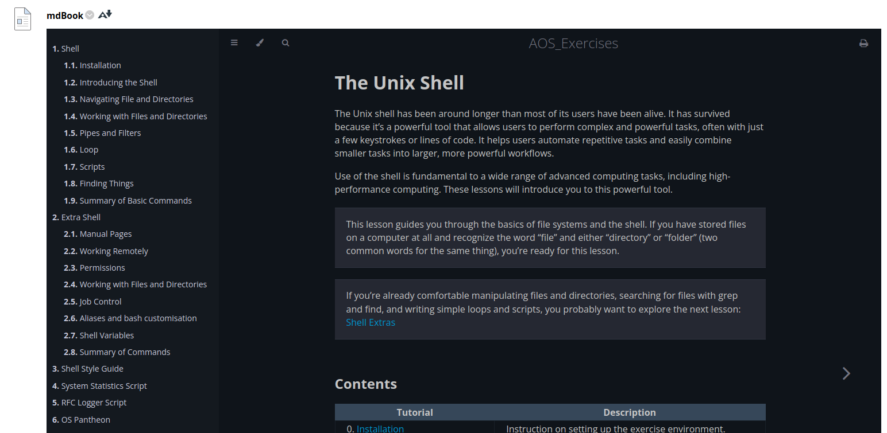

# Blackboard setup

To embed the mdBook into your module learning resources just using the following the `iframe` configuration. 

1. Add item
2. Select the source code icon `<>` 
3. Enter the following... 
   ```html
   <p><iframe width="100%" height="1200" src="https://cccu-uk.github.io/Module_mdBook_template/" frameborder="0" scrolling="yes"></iframe></p>
   ```
4. Note that the `src=https://cccu-uk.github.io/...` is the default address as cccu-uk is the organisation on GitHub. After `github.io/` is the name of your repository you have setup.
5. Using `width=100%`, users will be able to split the windows and the mdBook will display correctly.
