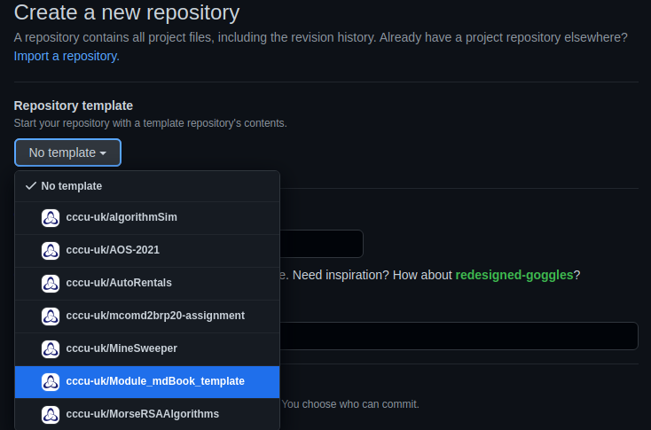
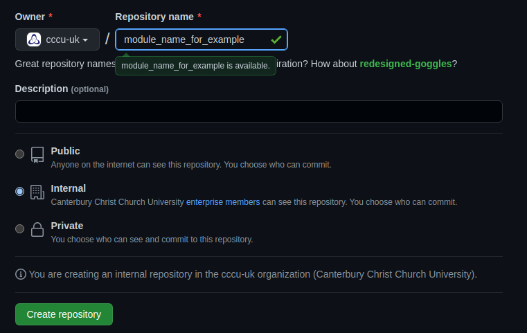
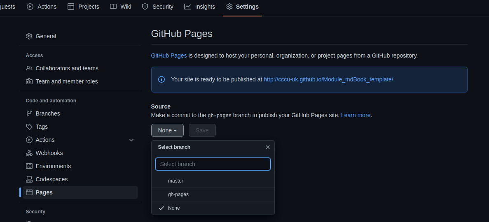
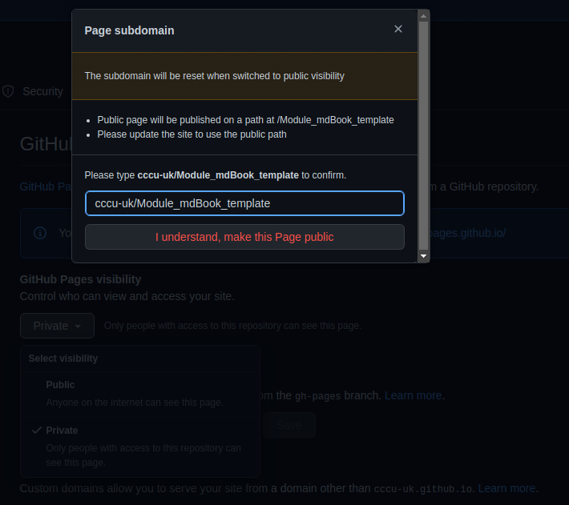

# Github Setup

In order to get your mdBook to publish correctly you must follow this setup!

## Step 1

This repo is to be used as the template, click this link to create a new repo at cccu-uk [new repo](https://github.com/organizations/cccu-uk/repositories/new) for creating module mdBooks. 

Selet from templates `cccu-uk/Module_mdBook_template` as seen below: 



Next give your repo a name, best practice would be module code/name + exercies for example FCC_Exercices or PFL_Exercices. Don't forget to select `internal` option for only cccu member to access.



## Step 2
Now you have a new repository navigate to the settings tab and select pages from the left hand menu as seen below and where the drop down box for source select `gh-pages`:



Once this has been done, select the <kbd>Save</kbd> button and set page to `public` for now and enter the **name of your repo** here, as seen below and click I understand... 




## Step 3

Now that you have set up the repo and github pages, feel free to edit the `authors` and `title` fields in the `book.toml` file, located in the parent directory for the repo.

```toml
[book]
authors = ["Contributor(s) name"]
title = "Templated mdBook"
language = "en"
multilingual = false
src = "content"
```

**Step n...**
