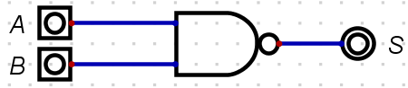

# Exploring Logic Gates

The **Exploring Logic Gates** lab is designed for you to explore the basic logic gates, simple logic circuits and truth tables. You will be using ``, a simulation tool for logic gates and other computer hardware.

---

#### IMPORTANT

Download and extract to a convenient place on your OneDrive or other cloud storage centre so the application is accessible on any machine you use.

Digital source code and project can be found on here:

-  [https://learn.canterbury.ac.uk/bbcswebdav/pid-3125140-dt-content-rid-4509659/xid-4509659](https://learn.canterbury.ac.uk/bbcswebdav/pid-3125140-dt-content-rid-4509659_1/xid-4509659_1) or...
- From here [logic_simulator](./Logic_Simulator.zip)

If you are stuck **ASK FOR HELP**.

Once downloaded place in your OneDrive and unzip. Navigate to the `Digital` application and run.

 - Linux see this video [Linux Installer Guide](https://cccu.yuja.com/V/Video?v=90006&node=366847&a=1518664755&autoplay=1)

Watch the video provided in the link below, where you are guided through the basic operations of Digital that are needed for the is lab here:

- [Introduction to Digital](https://cccu.yuja.com/V/Video?v=81805&node=337653&a=1303215335&autoplay=1)

Once you have watched this you may continue with the lab sheet.

---

## Exercise One

In this exercise you are going to familiarise your self with placing components and operating the Logic Gates.

The image below shows the location of where you will find the **Input** and **Output** components. You will need to select at least one **Output** and one or two **Input** components:

Next logic gates are selected as seen in the image below:

### NOT 

Firstly, set up the the circuit in below:

Press the the play icon, &#9658, and toggle the input component labelled as 'A', does it behavior as per the truth table below?

|A  | S|
|---|---|
|0  | 1|
|1  | 0|

> **CALL TO ACTION**
>> Save the circuit in OneDrive call it `Logic-Gates-Exercise-1`

### OR

Continuing in the same file add the OR gate underneath the NOT circuit so that your new circuit looks like below.

Press the the play icon, &#9658, and toggle the input component labelled as
'A' and 'B', does it behavior as per the truth table below?

|A  | B  | S|
|---| ---| ---|
|0  | 0  | 0| 
|1  | 0  | 1| 
|0  | 1  | 1| 
|1  | 1  | 1| 

> **CALL TO ACTION**
>> Re-save the circuit again.

### AND

Continuing in the same file add the AND gate underneath the OR so that your :new circuit looks like the image below.

Press the the play icon, &#9658, and toggle the input component labelled as 'A' and 'B', does it behavior as per the table below?

|A  | B  | S|
|---|---|---|
|0  | 0  | 0|
|1  | 0  | 0|   
|0  | 1  | 0| 
|1  | 1  | 1|    

> **CALL TO ACTION**
>> Re-save the circuit again.

### XOR

Continuing in the same file add the XOR gate underneath the AND circuit so that your new circuit looks like the image below:

Press the the play icon, &#9658, and toggle the input component labelled as
'A' and 'B', does it behavior as per the truth table below:

|A  | B  | S|
|---|---|---|
|0  | 0  | 0|          
|1  | 0  | 1|    
|0  | 1  | 1|    
|1  | 1  | 0|    

> **CALL TO ACTION**
>> Re-save the circuit again

### XNOR

Continuing in the same file add the XNOR gate underneath the XOR circuit
so that your new circuit looks like image below:

Press the the play icon, &#9658, and toggle the input component labelled as 'A' and 'B', does it behavior as per the truth table below:

|A  | B  | S|
|---|---|---|
|0  | 0  | 1| 
|1  | 0  | 0|
|0  | 1  | 0|
|1  | 1  | 1|

> **CALL TO ACTION**
>> Re-save the circuit again

### NOR

Continuing in the same file add the NOR gate underneath the XNOR circuit
so that your new circuit looks like the image below:

Press the the play icon, &#9658, and toggle the input component labelled as 'A' and 'B', does it behavior as per the truth table below?

|A  | B  | S|
|---| ---| -|
|0  | 0  | 1|   
|1  | 0  | 0|  
|0  | 1  | 0|   
|1  | 1  | 0|   

> **CALL TO ACTION**
>> Re-save the circuit again

### NAND 

Continuing in the same file add the NAND gate underneath the NOR circuit
so that your new circuit looks like the image below:

Press the the play icon, &#9658, and toggle the input component labelled as 'A' and 'B', does it behavior as per the truth tabel below:

|A  | B  | S|
|---|---|---|
|0  | 0  | 1|    
|1  | 0  | 1|    
|0  | 1  | 1|    
|1  | 1  | 0|    

> **CALL TO ACTION**
>> Re-save the circuit again

---

## Exercise Two: Investigation

The following universal logic gate circuits below can be constructed to create any of the fundamental gates. Investigate with the construction of truth  ables match a universal logic gate circuit with a fundamental logic gate.

### Universal Logic Circuit 1

> **CALL TO ACTION**
>> Create a new file.

Firstly, set up the the circuit as seen below:

Press the the play icon, &#9658, and toggle the input component labelled as 'A', what fundamental gate is this?

- AND

- XNOR

- NOT

- OR

---

<b>Click for solution</b>

- **NOT**

---

Once you have found the answer, navigate back to and select `Components` ->  `IO` and label the circuit with your answer.

> **CALL TO ACTION**
>> Save the circuit in OneDrive call it `Logic-Gates-Exercise-2`

### Universal Logic Circuit 2

Set up the the circuit in image below and place the new circuit beneath the last circuit created.

Press the the play icon, &#9658, and toggle the input component labelled as 'A' and 'B', what fundamental gate is this?

- XNOR

- OR

- NOT

- NAND

- AND

---

<b>Click for solution</b>

- **AND**

---

Once you have found the answer, navigate back to and select `Components` ->  `IO` and label the circuit with your answer.

> **CALL TO ACTION**
>> Re-save the circuit

### Universal Logic Circuit 3

Set up the the circuit below and place it beneath the last circuit created.

Press the the play icon, &#9658, and toggle the input component labelled as 'A' and 'B', what fundamental gate is this?

- XNOR

- OR

- NOT

- NAND

- NOR

---

<b>Click for solution</b>

- **OR**

---

Once you have found the answer, navigate back to and select `Components` ->  `IO` and label the circuit with your answer.

> **CALL TO ACTION**
>> Re-save the circuit

### Universal Logic Circuit 4

Set up the the circuit as seen below, beneath the last circuit created.

Press the the play icon, &#9658, and toggle the input component labelled as 'A' and 'B', what fundamental gate is this?

- XOR

- OR

- NOT

- AND

- NOR

---

<b>Click for solution</b>

- **XNOR**

---

Once you have found the answer, navigate back to and select `Components` ->  `IO` and label the circuit with your answer.

> **CALL TO ACTION**
>> Re-save the circuit

### Universal Logic Circuit 5

Set up the circuit up as seen below, beneath the last circuit created.

Press the the play icon, &#9658, and toggle the input component labelled as 'A' and 'B', what fundamental gate is this?

- NOT

- XOR

- OR

- AND

- XNOR

---

<b>Click for solution</b>

- **XOR**

---

Once you have found the answer, navigate back to and select `Components` ->  `IO` and label the circuit with your answer.

>**CALL TO ACTION**
>> - Re-save the circuit
>> - Go to your preferred search engine and search for 'Universal gate equivalents' and replicate the circuits we have not done in this file.

---
## Exercise Four: Experimentation

You are now going to use the clock to generate **signals**: **ON/OFF** or **1/0** or **HIGH/LOW** or **0V/5V**.

> **CALL TO ACTION**
>> Create a new file.

Now get the components in the following order, so that your circuit looks like below:

1.  AND Gate

2.  Input

3.  Clock Input

4.  Output

5.  Data Graph

Like with all other circuits so far, right click a component and them labels as shown above. 

You will notice that when you right click the Clock Input you will get additional options, replicate the image below:

Make sure that the Data Graph component option `Max number of steps to` is set to 25.

When you run this circuit you should see something similar to the image below:

> **CALL TO ACTION**
>> - Save the circuit in OneDrive call it ``
>> - Experiment with different Clock Input Frequencies, what observations can you make? Discuss with the a peer or with the tutor.
>> - Replace the `` with another `` and chose different frequencies. Look at the Data Graph is there a pattern? Is it random? Discuss with your peers or with the tutor.

---

## Exercise Five: Investigate

You are now going to create an arithmetic circuits; Half Adder and Full Adder

> **CALL TO ACTION**
>> Create a new file.

### Half Adder

Reproduce the Half Adder as seen in below:

{#fig:Half_Adder}

... and then simulate so you can complete the truth table below:

|**A** |  **B** |  **S** |  **Cout**|
|----- |  ----- |  ----- |  --------|
|     |      |       |       |
|     |      |       |       |
|     |      |       |       |
|     |      |       |       |
                          
                        
---

<b>Click for solution</b>

|**A** |  **B** |  **S** |  **Cout**|
|----- |  ----- |  ----- |  --------|
|0     |    0   |    0   |      0 |
|0     |    1   |    1   |      0 |
|1     |    0   |    1   |      0 |
|1     |    1   |    0   |      1 |

---
                        

## Full Adder

Produce a Full Adder and then simulate so you can populate, you should refer to the lecture slides.

|**A**   |**B**  | **Cin** |   **S** |  **Cout**|
|------- |-------| --------|  -------| ---------|
|       |     |       |       |        |   
|       |     |       |       |        |
|       |     |       |       |        |
|       |     |       |       |        |
|       |     |       |       |        |
|       |     |       |       |        |
|       |     |       |       |        |
|       |     |       |       |        |
   
                            
---

<b>Click for solution</b>

|**A**   |**B**  | **Cin** |   **S** |  **Cout**|
|------- |-------| --------|  -------| ---------|
|0       |   0   |     0   |      0  |         0|   
|0       |   0   |     1   |      1  |         0|
|0       |   1   |     0   |      1  |         0|
|0       |   1   |     1   |      0  |         1|
|1       |   0   |     0   |      1  |         0|
|1       |   0   |     1   |      0  |         1|
|1       |   1   |     0   |      0  |         1|
|1       |   1   |     1   |      1  |         1|

---   
                              
> **CALL TO ACTION**
>> - Save the circuit in OneDrive call it ``
>> - Experiment with different Clock Input Frequencies, what observations can you make? Discuss with the a peer or with the tutor.
>> - Replace the `` with another `` and chose different frequencies. Look at the Data Graph is there a pattern? Is it random? Discuss with your peers or with the tutor.

---
# Exercise Six: Research and Implement

Investigate & research the circuit of a 2-bit decoder, implement this and verify operation through a complete truth table and simulation.

> **CALL TO ACTION**
>> Create a new file.