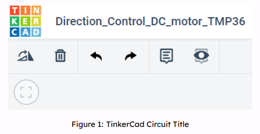
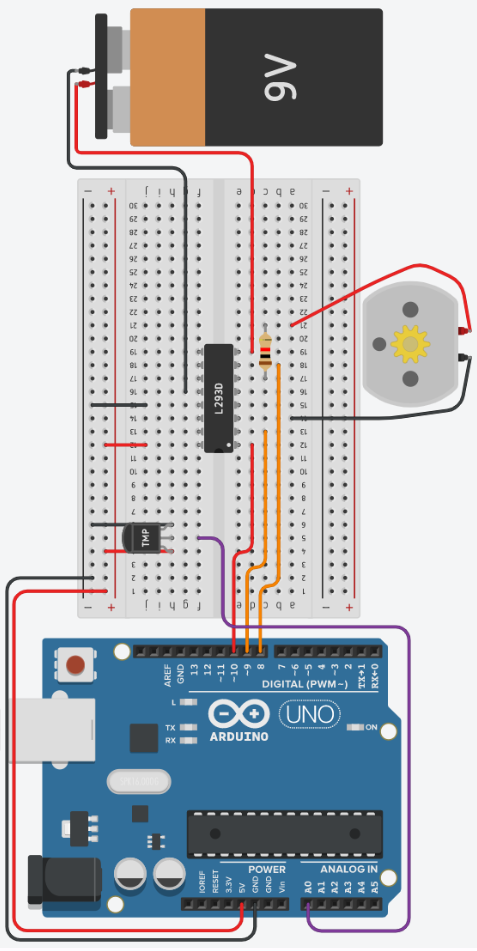

# Motor Control Board based on Temperature Differences, using TinkerCad

## 1 Introduction 

In today’s activity we will use an Arduino and a H-bridge controller to engage a DC motor to move in a postive or negative direction based on a temperature value. This could be useful to move plants & canopy in response to heat from the Sun.

> The primary tool for this project will be TinkerCad -> https://www.tinkercad.com
-------------------

## 2 RPM, Rad/s, Angular Velocity(Deg/s)

This section provides a quick recap on Revolution Per Minute, Radians Per Second, and Degrees per second. Being able to interchange between these values will help you visualise.

**RPM:**
- the number of complete turns (full revolutions) the engine or wheel makes in a one-minute time
period
- remember that this is only per minute, not per second like many other measures of rotation.

**Rad/s:**
- A radian is a measure of an angle, and it is defined in terms of π
- 2π radians (rad) in a complete revolution
- You can relate this to degrees by noting that **360 degrees = 2π rad**, so **1 radian = 180 degrees/π = 57.3 degrees**

So lets assume that we have a RPM of 1000, and that this needs to be converted to rad/s. The two main steps in the conversion are converting RPM to revolutions per second (RPS), then converting total revolutions to the angle covered in radians. The first step is simple: Divide the number in RPM by 60 to find the number of revolutions per second, as shown in **equation 1**:

<p>
   <span class="math display">
      \[
         \begin{aligned}
           \frac{RPM}{60 seconds/minute}  &amp;= RPS 
           \end{aligned}\tag{Eqn:1} 
      \]
   </span>
</p>

 <p>
   <span class="math display">
      \[     
         \begin{aligned}
         e.g., \frac{1000RPM}{60sec} &amp;= 16.7 RPS 
         \end{aligned}
      \]
   </span>
</p>


Now we need to convert the RPS to Rad/s. Take RPS and convert to radians by multiplying by 2π, as seen in **equation 2**:

<p>
   <span class="math display">
      \[
         \begin{aligned}
             RPS \cdot 2\pi  &amp;= rad/s 
             \end{aligned}\tag{Eqn:2}
      \]
   </span>
</p>
<p>
   <span class="math display">
      \[ 
         \begin{aligned} 
         e.g., 16.7RPS \cdot 2\pi &amp;=104.7 rad/s 
         \end{aligned}  
      \]
   </span>
</p>


Combining **equations 1** and **2** gives **equation 3**:
<p>
   <span class="math display">
      \[
         \begin{aligned}
            RPM \cdot \frac{2\pi}{60sec} &amp;= rad/s
         \end{aligned}\tag{Eqn:3}
      \]
   </span>
</p>

Therefore, for our initial example of 1000RPM, to convert to rad/s we do the following:
<p>
   <span class="math display">
      \[
         \begin{aligned}
         1000RPM \cdot \frac{2\pi}{60sec} &amp;= 104.7 rad/s
         \end{aligned}
      \]
   </span>
</p>


Now that we have rad/s, we can calculate the angular velocity in degrees per second (deg/s). There are two ways to achieve this and both methods are shown below in **equations 4** and **5** respectiely. 


**Equation 4** first takes the approach using the knowledge that **1 rad = 180 degrees/π = 57.3 degrees**, as you have pre-calculated using **equation 3**:
<p>
   <span class="math display">
      \[
         \begin{aligned}
            rad/s \cdot 180^{\circ} &amp;/π = deg/s    
         \end{aligned}\tag{Eqn:4}
      \]
   </span>
</p>
or 
<p>
   <span class="math display">
      \[
         \begin{aligned}
          rad/s \cdot  57.3^{\circ} &amp; = deg/s   
         \end{aligned}
      \]
   </span>
</p>


<p>
   <span class="math display">
      \[
         \begin{aligned}
          e.g., 104.7 rad/s \cdot 180^{\circ} &amp;/π = 628.3^{\circ}/s   or  104.7 rad/s \cdot 57.3^{\circ} &amp; = 628.3^{\circ}/s     
      \end{aligned}
      \]
   </span>
</p>


**Equation 5** replaces \\(2\pi\\) in **Equation 3** with 360 degrees:
<p>
   <span class="math display">
      \[
         \begin{aligned}
            RPM \cdot \frac{360^{\circ}}{60} \cdot 57.3^{\circ} &amp;= deg/s
         \end{aligned}\tag{Eqn:5}
      \]
   </span>
</p>
<p>
   <span class="math display">
      \[
         \begin{aligned}
            e.g., 1000RPM \cdot \frac{360^{\circ}}{60sec} \cdot 57.2958^{\circ} &amp;= 628.32^{\circ}/s  
         \end{aligned}
      \]
   </span>
</p>

**Questions:**

<details>
<summary>Convert 53 RPM to Angular velocity to 2 decimal places</summary>

\\(318^\circ\\)

</details>

<details>
<summary>Convert 4242 RPM to Angular velocity to 2 decimal places.</summary>

\\(25452^{\circ}\\)

</details>

-----------------------------
## 3 The Motor Driver L293D

In this setup we will be using the L293D Dual H-bridge Motor Driver to control our motor. The L293D is a 16-pin integrated circuit (IC) that has 8 pins on either side. 

The L293D IC receives signals from the Ardiuno microprocessor and then transmits the relative signal to the motor(s) attached to it. This motor driver can drive 2 DC motors simultaneously, and can drive them in either direction while also controlling the speed of the motor(s).

It has a wide supply voltage range of 4.5 - 36V and can provide biderectional drive currents of up to 600 mA. Being a (dual) H-bridge, it is also the simplest circuit for controlling a low current-rated motor.

**Pins on the L293D IC**

 *LEFT SIDE of the  L293D IC*
- **Pin 1 - Enable 1,2:**  This will enable the left part of the L293D IC. When the pin is on HIGH, the left part of the IC is operational. If the pin is on LOW, the left part of the IC is not operational. NOTE: if the left part is not operational, this does not mean the right side is automatically operational! Enable 3,4 (see below) is responsible for the right-hand side of the IC. 
- **Pin 2 - Input 1:** If this pin is on HIGH, so is output 1 (i.e., the current will flow through output 1).
- **Pin 3 - Output 1:** This pin connects to one of the terminals of motor 1. 
- **Pin 4 and Pin 5 - GND:** Grounding pins (connected to ground).
- **Pin 6 - Output 2:** Current will flow through this pin if Input 2 is HIGH (i.e., pin 7 will also be HIGH).
- **Pin 7 - Input 2:** If this pin is on HIGH, so is Output 2.
- **Pin 8  - VCC2:** THe voltage required to run the motor, and it can be greater than the IC voltage VCC1. You need to supply this pin with the correct voltage, e.g., if you are driving 9V DC motors, then Pin 8 needs to be supplied with 9V.


*RIGHT SIDE of the  L293D IC*
- **Pin 9 - Enable 3,4:**  This will enable the right part of the L293D IC. When the pin is on HIGH, the right part of the IC is operational. If the pin is on LOW, the right part of the IC is not operational. 
- **Pin 10 - Input 3:** If this pin is on HIGH, so is output 3 (i.e., the current will flow through output 3).
- **Pin 11 - Output 3:** This pin connects to one of the terminals of motor 2. 
- **Pin 12 and Pin 13 - GND:** Grounding pins (connected to ground).
- **Pin 14 - Output 4:** Current will flow through this pin if Input 4 is HIGH (i.e., pin 14 will also be HIGH).
- **Pin 15 - Input 4:** If this pin is on HIGH, so is Output 4.
- **Pin 16  - VCC1:** THe voltage required to run the L293D IC. This pin is usually supplied with 5V.

>
>

**NOTES**
- **Pins Enable 1,2 and Enable 3,4** can be used to turn ON/OFF and control the speed of motor 1 and motor 2 respectively. 5V DC connection to these pins will allow for normal speed operation of the motor. Pulse Width Modulation (PWM) output can be provided to these pins via the Arduino microcontroller. 
- **Input pins 1 - 4** act as directional control pins, with input pins 1-2 controlling motor 1 and input pins 3-4 controlling motor 2. For example, if the input logic at input pins 1 & 2 is (1,0), motor 1 will spin in one direction. Changing the input logic on these pins to (0,1) will make the motor spin in the opposite direction. 
- **4 GND pins** are needed to act as heat sinks to reduce the heating (and subsequent damage) caused by the heavy currents. 


For reference, look at the image below for the L293D H bridge functional block diagram and pin layout.

<div align=center>


</div>

-------------
## 4 Setting up the circuit

Login to TinkerCad and then click on **Circuits** > **Create new Circuit**.

Change the circuit name (located top-left hand side of the screen) to **Direction_Control_DC_Motor\_TMP36**, as see below.

<div align=center>



</div>


Next, you need to add an Arduino Uno and a breadboard that need to be connected together from the 5V and GND pins of the Arduino board to the power and ground rails of the breadboard.

This can be achieved by either selecting the Arduino Uno and the breadboard from\ **Components** > **Basic** components, or by changing **Components** > **Basic** to **Components** > **Starter** and choosing Arduino Uno and the Breadboard starter. Please refer to the image below.

<div align=center>


</div>

If you have chosen the Arduino and breadboard template from the **Components** > **Starter** then these two components are already connected with a corresponding 5V line(red) and GND line. 

**You now need to add:**

1. 1 x TMP36, temperature sensor: **Components** > **Basic**; bottom of the list or, alternatively, use the search box
2. 1 x resistor set at 1k\\(\Omega\\) or 1000\\(\Omega\\):  **Components** > **Basic**; first component in the list
3. 1 x L293D, H-bridge Motor Driver: **Components** > **All**; last item in the Power control section of the list or, alternatively, use the search box
4. 1 x DC Motor: **Components** > **Basic**; 14th item in the list or, alternatively, use the search box
5. 1 x 9V D-Cell Battery: **Components** > **Basic**; 7th item in the list or, alternatively, use the search box.


Placing components (refer to the image below): 

1. Place the TMP36 so that the **Power** and **GND** are in row **4** and **6**  respectively, and both are in column **h**. Take a wire from the **Vout** of the sensor (row **5** column **g**) to pin **A0** of the Arduino Uno. 
   
2. Place the L293D chip so that the white dot (pin **enable 1 & 2**) is in row **12** and column **e**, therefore the pin labeled **Power 2** should be in row **19** column **e**. You should have the H-bridge between both sides of the breadboard (rows e and f). 
   
3. Staying with the L293D bridge, create a red wire at row **12** column **j** going to the **+** line of the same row. This connects the L293D **Power 1** pin to the Arduino 5V line. 
   
4. Next, create a black wire at row **15** column **j** going to the **-** of the same row. This connects the L293D **Ground** pin to the Arduino GND line.
   
5. Create a new red wire just below pin **Enable 1 & 2** of the L293D bridge, at row **12** column **d**, going to pin **10** of the Ardunio Uno. 
   
6. Create an orange wire at row **13** column **c**, below pin **Input 1** of the L293D bridge, going to pin **9** of the Arduino Uno. 

7. Create an orange wire at row **18** column **d**, below pin **Input 2** of the L293D brdige, going to pin **8** of the Arduino Uno.
   
8. Get the 9V Battery and places it in vertical alignment using the rotate button at the top left of the control panel. Place the battery so that it is parallel to the breadboard on the opposite side the Arduino Uno. 
   
9.  Create a red wire from the **Positive** terminal of the battery and connect it to row **19** column **d**, just below  pin **Power 2** of the L293D bridge.
    
10. Similarly, create a black wire from the **Negative** terminal of the battery and connect it to row **16** column **g**, just above the other L293D **Ground** pin.
    
11. Now place the DC motor underneath the breadboard, between rows **13** and **25**
    
12. Continuing with the DC motor, take a black wire from **Terminal 1** of the DC motor and connect it to row **14** column **a**, inline with L293D **Output 1**.

13. Similarly, take a red wire from **Terminal 2** of the DC motor and connect it to row **20** column **a**

14. Lastly, take the resistor and set it to \\(1k\Omega\\). Rotate it so that it lies horizontally, and then connect the **Terminal 1** pin to row **17** column **c** of the breadboard, inline with L293D **Output 2**. This means **Terminal 2** of the resistor should be connected to row **21** column **c**.

Your setup should look like this:
<div align=center>

</div>

------------
## 5.  Programming The Circuit

Once you have completed the circuit you will need to programme the Arduino Uno. Click the **Code Text** located above **Components**. Once sketch has appeared, reproduce the following code:

```C++
void setup()
{

}

void loop()
{

}
```

Now you are ready to set up all of the Sketch up as follows.

```C++
#define en 10
#define in1 9
#define in2 8
#define temp A0

void setup()
{

}

void loop()
{

}
```

Firstly, the variables are declared and initialised using the `#define` keyword.

Lines 1 to 3 define the variables `en 10`, `in1 9` and `in2 8` and will reference the physical connections of the L293D: Enable 1 & 2, **Input 1**, and **Input 2** respectively.

Line 4, defines the variable `temp A0` which will reference the physical connection of the TMP36 temperature sensor`Vout` pin.

> TODO: 
> 
> Add inline comments on lines 1 - 4 for what each variable is for, using the // comment symbols

Secondly, the dynamic variables are declared and initialised using data types `int`, `float` and `bool`.

```C++
float pwmOutput = 12;
float tempValue;
float temperature;
float rads = 0.0;
float degrees = 0.0;
bool movedRight = false;
bool movedLeft = false;
```
Line 6, `float pwmOutput = 12;`, will store the value that will be used in the `analogWrite()` function. Use float and not int! 

Lines 7 and 8, variables `float tempValue; float temperature;` respectively, will store the `analogRead()` value and the converted temperature value respectively. 

Lines 9 and 10, variables `float rads =0.0;` and `float degrees = 0.0;` respectively, will store the calculated values for radians per second and degrees per second respectively.

Lines 11 and 12, variables `bool movedRight = false;` and `bool movedLeft = false;` respectively, are used to stop the motor turning continuously.

Lines 13-15 include some more variables that will be used to calculate RPM. Speciifcally, line 13 contains rpm (to store the calculated rounds per minute), line 14 contains PWM (which stores the percentage of the total voltage used in the modulation), and line 15 contains lnOhm: this will be used to store the natural logarithm of the resistance value. You will need to enter this resistance value in the code manually every time you change the value on the resistor. 

The script should now look like this:

```C++
#define en 10
#define in1 9
#define in2 8
#define temp A0

float pwmOutput = 12;
float tempValue;
float temperature;
float rads = 0.0;
float degrees = 0.0;
bool movedRight = false;
bool movedLeft = false;
float rpm = 0;
float PWM = (pwmOutput)*100/255;
float lnOhm = 0;

void setup()
{

}

void loop()
{

}
```

> TODO: 
> 
> Add inline comments on lines 6 - 15 for what each variable is for, using the // comment symbols

The `void setup()` will be used to set the pin modes and initialise the serial.

```C++
void setup()
{
  Serial.begin(9600);
  pinMode(en, OUTPUT);
  pinMode(in1, OUTPUT);
  pinMode(in2, OUTPUT);
}
```

Line 19's code, `Serial.begin(9600);`, sets the Serial speed at 9600 bits per second (bps)

Line 20's code, `pinMode(en, OUTPUT);`, sets pin 10 on the Arduino Uno as an output so that a signal can be sent to the **Enable 1 & 2** pins of the L293D chip.

Code of line 21 and 22, `pinMode(in1, OUTPUT);` `pinMode(in2, OUTPUT)` respectively, set pin 9 and 8 on the Arduino Uno as outputs so that a signal can be sent to the **Input 1 & 2** pins of the L293D chip respectively.

```C++
#define en 10
#define in1 9
#define in2 8
#define temp A0

int pwmOutput = 12;
float tempValue;
float temperature;
float rads = 0.0;
float degrees = 0.0;
bool movedRight = false;
bool movedLeft = false;

void setup()
{
  Serial.begin(9600);
  pinMode(en, OUTPUT);
  pinMode(in1, OUTPUT);
  pinMode(in2, OUTPUT);
}

void loop()
{

}
```

> TODO: 
> 
> Add inline comments on lines 16 - 19 for what each variable is for, using the // comment symbols

```C++
 void loop()
{
  tempValue = analogRead(temp);
  temperature = ((tempValue*(5.0/1024.0))-0.5)/0.01;

  if( temperature <= 30.0 && movedRight == false)
  {
    motorInstructions();
    debugger();

    digitalWrite(in1, LOW);
    digitalWrite(in2, HIGH);
    delay(1000);
    digitalWrite(in2, LOW);
    movedRight = true;
    movedLeft = false;
  }
  else if ( temperature >= 40.0 && movedLeft == false)
  {
    motorInstructions();
    debugger();

    digitalWrite(in1, HIGH);
    digitalWrite(in2, LOW);
    delay(1000);
    digitalWrite(in1, LOW);
    movedLeft = true;
    movedRight = false;
  }
}
```

Starting with line 27, the code `tempValue = analogRead(temp);` will read the TMP36 wired to pin A0 of the Arduino, and convert voltage to the Analogue Digital Converted value. Remember, the voltage range is 0V to 5V, and the ADC of the Arduino is 10-bits, so its range is 0 - 1023.

Line 28's code, `temperature = ((tempValue*(5.0/1024.0))-0.5)/0.01;}`, converts the the `temp` value, (0 - 358), to degrees Celsius with a range of \\(-40^{\circ}C\\) to \\(125^{\circ}C\\), see **equation 6**:

 
 <p>
   <span class="math display">
      \[
         \begin{aligned}
            \cfrac{\left(\left(tempValue \cdot \left( \cfrac{5.0V}{1024}\right)\right)-0.5\right)}{0.01} &amp;= temperature      
            \end{aligned}\tag{Eqn:6}
      \]
   </span>
</p>
 <p>
   <span class="math display">
      \[
         \begin{aligned}
        e.g., \cfrac{\left(\left(156 \cdot \left( \cfrac{5.0V}{1024}\right)\right)-0.5\right)}{0.01} &amp;=  26.17^{\circ}C 
        \end{aligned}
      \]
   </span>
</p>

> TODO: 
> 
> Add inline comments on lines 27 - 28 for what each variable is for, using the // comment symbols

Now that the `temperature` value has been calculated, lines 27 and 41 can be explained.

Line 29's code, `if( temperature <= 30.0 && movedRight == false)`, checks to see if the `temperature` is less than or equal to, `<=`, 30.0. If this condition is `true` then the second part of the conditional statement can be checked, using `&&`. The boolean (true or false) variable `movedRight == false` is compared for equality `==`. 
Now if both conditions are true then the code between lines 30 and 39 will be executed. If either statement is false, then line 40 is executed. 

**NOTE:** a single `=` means assign the right hand side value to the left hand side, whereas double `==` is a comparison operator. 

Line 42's code is much the same as line 31's, but the `temperature` has to be greater or equal to, `>=`, 40.0 and `movedLeft` must be false. If both statements are true then lines 42 to 49 are executed. If either or both statements are false then the programme loops back to the line 25, and the process starts again. 

When looking inside lines 31 to 38 & lines 42 to 49, you can see that there are only a few differences between the two blocks of code. We will look at lines 31 - 32 and 42 - 43 later. 

Lets look at lines 33 - 34 and 44 - 45, where the two sets of lines are polar opposites of each other. The `digitalWrite(in1, LOW);` `digitalWrite(in1, HIGH);` & `digitalWrite(in2, LOW);` `digitalWrite(in2, HIGH);` changes the direction the motor spins. 

Looking at the block diagram of the L293D bridge, we can see that Input 1 (pin 3 on the bridge) and Input 2 (pin 7 on the bridge) change the direction of the motor.

The code of lines 35 and 46, `delay(1000)`, gives the motor 1 second to turn in the programmed direction. 

> TODO: 
> 
> Add inline comments on lines 33 - 36 & 44 - 48 for what each variable is for, using the // comment symbols

Lines 37 - 38, and 48 - 49 both set the `movedLeft` and `movedRight` variables as true or false.

Now it is time to return to lines 31 & 42. Both sets of lines do the same things, so look below at the code for `motorInstructions();`, which is added to end of the script after the closing `}` of the `void loop()`.

```C++
void motorInstructions()
{
  lnOhm = log(1000);
  rpm = -0.2739*pow(lnOhm,5) + 5.8199*pow(lnOhm,4) - 38.133*pow(lnOhm,3) + 67.064*pow(lnOhm,2) - 45.327*lnOhm + 799.41;
  rads = rpm*0.10472; 
  degrees = rads * 57.2958;
  analogWrite(en, pwmOutput);
}
```

Let's first look at line 54's code: `lnOhm = log(1000);`. This code gives us the natural logarithm of the resistor value. The value in the paranthesis is the resistance value in Ohm, e.g., 1KΩ = 1000Ω. You will need to change this value every time you change the value on the resistor. This value is needed to calculate the rounds per minute of the motor. 

Line 55 gives us a polynomial equation specific to this system. It is used to calculate the motor's rounds per minute using the aforementioned resistor value. It also changes linearly with the PWM: decreasing the PWM by half changes the result of the rpm equation by half. Please note that this equation is specific to this system, as mentioned above, and has an error of app. +/- 10%. 

The code in line 56 calculates the radians per second, whereby **1rad/s = 60rad/min = 60/2π rpm = 9.549297 rpm**. 

Line 57's code, `degrees = rads * 57.2958;`, is taken from **equation 4** and is used to calculate degrees per second. 

Line 58's code, `analogWrite(en, pwmOutput);`, outputs the PWM signal,`pwmOutput`,  value of 12 to the `en` pin, to the **Enable 1 & 2** pin of the L293D. The value of `en`, 12, again is preset because of the resistor's initial value of \\(1k\Omega\\).

So lastly, lets look at the function `debugger();`, called on lines 32 and 43 of the `void loop()` function. 

```C++
void debugger()
{
  Serial.print("Temperature: ");
  Serial.print(temperature);
  Serial.print("  | RAD/s: ");
  Serial.print(rads);
  Serial.print("   | Degree/s: ");
  Serial.print(degrees);
  Serial.print(" | rpm: ");
  Serial.println(rpm);
}
```
Lines 64 to 71 output information about the variables to the serial montior.

Now you have a better understanding of the circuit and the code ...

> TODO: 
> 
> - What happens to the motor when the resistance value is changed? Adjust line 54's value to match the resistance on the resistor. 
> - Why are we using float for some variables and int for others? What would happen if, for example, we defined PWM or lnOhm via int instead of float?
> - Why was #define used on some variables?
> - With the knowledge that each line of code takes *some* time to execute, specifically mathematical functions, would pre-calculating all of the constants in an equation speed up the programme? Try it.
> -  Explore the code; make changes to experiment with different temperature values, PWM values, timings, and conditional statements (if, else if).

The full code is seen below:

```C++
#define en 10
#define in1 9
#define in2 8
#define temp A0

int pwmOutput = 12;
float tempValue;
float temperature;
float rads = 0.0;
float degrees = 0.0;
bool movedRight = false;
bool movedLeft = false;
float rpm = 0.0;
float PWM = (pwmOutput)*100/255;
float lnOhm = 0;

void setup()
{
  Serial.begin(9600);
  pinMode(en, OUTPUT);
  pinMode(in1, OUTPUT);
  pinMode(in2, OUTPUT);
}

void loop()
{
  tempValue = analogRead(temp);
  temperature = ((tempValue*(5.0/1024.0))-0.5)/0.01;

  if( temperature <= 30.0 && movedRight == false)
  {
    motorInstructions();
    debugger();
    digitalWrite(in1, LOW);
    digitalWrite(in2, HIGH);
    delay(1000);
    digitalWrite(in2, LOW);
    movedRight = true;
    movedLeft = false;
  }
  else if ( temperature >= 40.0 && movedLeft == false)
  {
    motorInstructions();
    debugger();
    digitalWrite(in1, HIGH);
    digitalWrite(in2, LOW);
    delay(1000);
    digitalWrite(in1, LOW);
    movedLeft = true;
    movedRight = false;
  }
}

void motorInstructions()
{
  lnOhm = log(1000);
 rpm = (14.449*pow(lnOhm,4)-100.83*pow(lnOhm,3)-354.06*pow(lnOhm,2)+309.41*lnOhm+16273)*(PWM/100);
  rads = rpm*0.10472;
  degrees = rads * 57.2958;
  analogWrite(en, pwmOutput);
}

void debugger()
{
  Serial.print("Temperature: ");
  Serial.print(temperature);
  Serial.print("  | Radians/s: ");
  Serial.print(rads);
  Serial.print("   | Degrees/s: ");
  Serial.print(degrees);
  Serial.print("   | rpm ");
  Serial.println(rpm);
}
```
