# Problem to Logic Circuit Design

The **Problem to Logic Circuit Design** lab is designed for you to get on with problem solving.

As described in the lecture slides, simulate the circuit using `Digital` simulator for the following problem specification for an alarm to ring. To understand how to use Digital simulator, revisit [Logic Gates](../Logic_Gates/Logic_Gates.md) worksheet.

---

## Example Scenario

The alarm will ring if the alarm switch is turned on and either the door is not closed or window is not closed; where variables are given below:

1.  Output Variable: Alarm = F ; 1 ON, 0 OFF

2.  Input variables : Alarm switch = A; 1 ON, 0 OFF

3.  Door status = B; 1 CLOSED, 0 OPEN

4.  Window Status = C ;1 CLOSED, 0 OPEN

The image below shows the components used for the minimised circuit is given below. You need place these components in the work area of Digital editor and then after wiring up simulate and check if the outputs are the same as in the truth table (see tutorial slide) for all possible inputs.

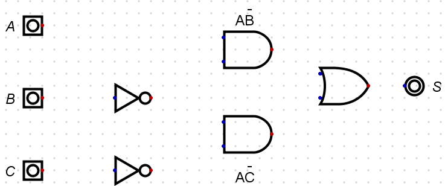

**CALL TO ACTION**

1.  Identify each gate without using Digital or notes?

2.  Wire up the circuit

3.  What is the Boolean Equation for this circuit?

4.  Minimise the Boolean Equation

5.  Redraw the circuit based on the minimised Boolean Equation

6.  Test the circuit for the following test conditions:

    -   ABC = 110

    -   ABC = 010

---

## Example Scenario Solution

The below circuit is the implementation of the following equation , which requires 5 gates:

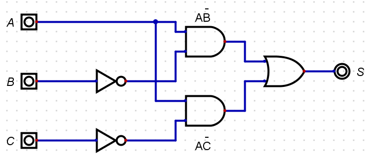

This circuit can be represented using the Boolean Equation below.

\\(S = A.\overline{B} + A.\overline{C}\\)

The minimisation process therefore is:

\\(S = A.\overline{B} + A.\overline{C}\\)

\\(S = A.\overline{B} +\\) ~~A~~ \\(.\overline{C}\\)

\\(S = A.(\overline{B} + \overline{C})\\)

Which in-turn produces the following images, with 4 gates:

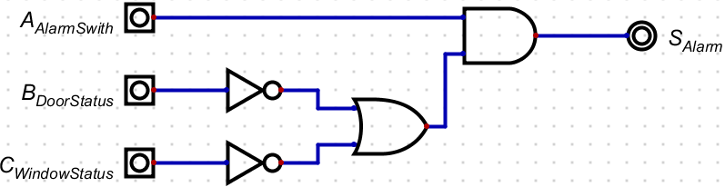

The circuit below shows the example simulation for the test condition for ABC=110:

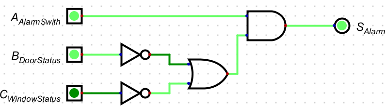

The same circuit with a change in input status shows the example simulation for the test condition for ABC=010:

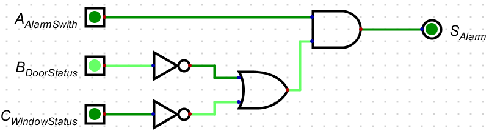

---
## Scenario 1

> **CALL TO ACTION**
>> Create a new file.

You need to create a logic circuit for a warning light which will be placed on a skip at night to warn any approaching drivers that there is a hazard in the road. The light should only operate in the dark and the light should be flashing. The light sensor produces a logic 0 in the daylight, and Logic 1 in the dark. Follow the steps below:

1.  Find the input and output variables

2.  Construct the Truth Table

3.  Write the Boolean Equation: \"Output = Sum of the Standard ProductTerms\"

4.  If needed, minimise the equation using Boolean Algebra

5.  Draw logic circuit for the minimised equation

6.  Using Digital simulator, do a multi-step timing diagram simulation.

Your simulation should have the same logic as seen in the image below.
    
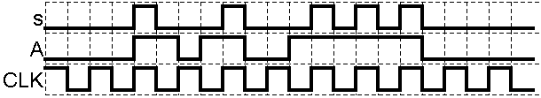

To understand how to do Timing diagram simulation (multistep) in Digital, revisit [Logic Gates](../Logic_Gates/Logic_Gates.md#exercise-four-experimentation) worksheet.

> **CALL TO ACTION**
>> - Save the circuit in OneDrive call it `Problem_To_Solution_Experiment_One`

---

<b>Click for Solution</b>

To identify you could create a simple block diagram of the system like below:

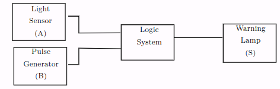

You will notice that the two inputs have now been given a letter so that we can identify them in a truth table. In this case there are only two inputs, and therefore there will be four possible combinations of A and B that we have to consider. The next stage is to construct a truth table to show all the possible input conditions and for each set of inputs determine when an output is required.

|**Input A**  | **Input B** |  **Output S** |  **Comments**|
|------------- |-------------| -------------- |-----|
|0 |0 |0|Light Sensor (**A**) = 0 \\(\equiv\\) Daylight, Pulse Generator **B**) = 0 \\(\equiv\\) Off, Output **S** = 0 Off |
|0 |1 |0|Light Sensor (**A**) = 1 \\(\equiv\\) Dark, Pulse Generator **B**) = 0 \\(\equiv\\) Off, Output **S** = 0 Off |
|1 |0 |0|Light Sensor (**A**) = 0 \\(\equiv\\) Daylight, Pulse Generator **B**) = 1 \\(\equiv\\) On, Output **S** = 0 Off |
|1 |1 |0|Light Sensor (**A**) = 1 \\(\equiv\\) Daylight, Pulse Generator **B**) = 1 \\(\equiv\\) On, Output **S** = 1 On Z |

From the truth table we can get the Boolean Equation, remember we only need to write out the equation where there is a **1** in the Output column.

\\(S = A.B\\)

Only one product term so this is the minimised equation, and you should be able to identify the logic gate from the truth table and the Boolean Algebra. See the image directly below for the logic gate solution:

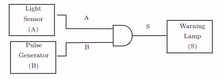

Now you should be able to create the circuit in in Digital like the following image:

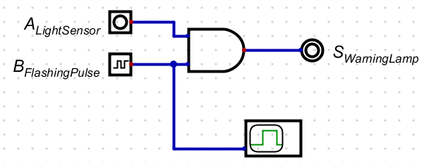

Notice that the circuit contains a `D` attached to the clock so that you can reproduce the .

---

## Scenario 2

> **CALL TO ACTION**
>> Create a new file.

Create a logic circuit for the buzzer of a car, and it should Buzz when:

1.  the engine is on, the door is closed, and the seat belt is unbuckled

2.  the engine is on, the door is open

Assume there are appropriate binary sensors for engine, door and seat belt. 

Create and simulate the circuit of the buzzer following the steps
below:

1.  Find input and output variables

2.  Construct the Truth Table

3.  Write the Boolean Equation : "Output = Sum of the Standard Product terms"

4.  If needed, minimise equation using Boolean Algebra

5.  Draw logic circuit for the minimised equation

6.  Using Digital Simulator, simulate the circuit.

> **CALL TO ACTION**
>> Save the circuit in OneDrive call it `Problem_To_Solution_Scenario_Two`

---

<b>Click for Solution</b>

Finding input and output variables:

1.  **Output**, Buzzer , S = 1 means ON, 0 means OFF

2.  **Inputs**, Engine Key, A = 1 means ON, 0 means OFF

  - Car Door, B=1 means Open, 0 means Closed
  - 
  - Seat belt , C=1 means buckled, 0 means Unbuckled

Using the list of input and output variables the truth table can be created:

|**A** | **B** | **C**|  **S** |
|------|-------|------| -------|
|0     | 0     | 0    | 0  |
|0     | 0     | 1    | 0  |
|0     | 1     | 0    | 0  |
|0     | 1     | 1    | 0  |
|1     | 0     | 0    | 1  |
|1     | 0     | 1    | 0  |
|1     | 1     | 0    | 1  |
|1     | 1     | 1    | 1  |                   
                                                   
From the truth table the Boolean Equation can now be derived using the `Sum of the Standard Product Terms`:

\\(S = ABC + AB\overline{C} + A\overline{B} \overline{C}\\)

\\(S = ABC + \\)~~AB~~ \\(\overline{C} + A\overline{B} \overline{C}\\) (remember: \\(\overline{C} + C = 1)\\)

\\(S = AB(C +\overline{C}) + A\overline{B} \overline{C}\\)

\\(S = AB(1) + A\overline{B} \overline{C}\\)

\\(S = AB + A\overline{B} \overline{C}\\)

\\(S = AB + \\) ~~A~~ \\(\overline{B} \overline{C}\\)

\\(S = A(B + \overline{B} \overline{C})\\)

\\(S = A(B +\\) ~~B~~ \\(\overline{C})\\)

(remember: a literal on its own cancels its inverted version).

\\(S = A(B + \overline{C})\\)

The first image shows the logic circuit implementation of the minimised Boolean Equation:

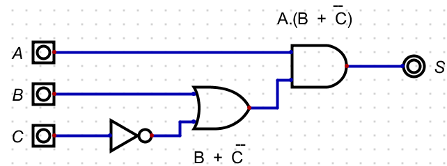

The image below shows the example simulation for the test condition for ABC=100:

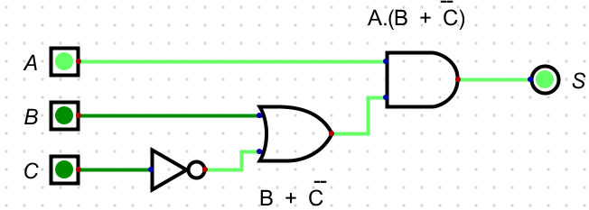

Penultimately, the circuit shows the example simulation for the test condition for ABC=100:

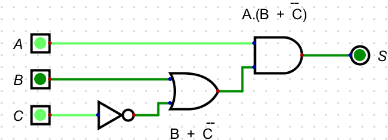

Finally, the image below shows the example simulation for the test condition for ABC=100:

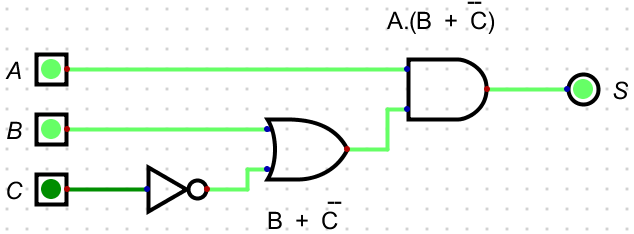

---