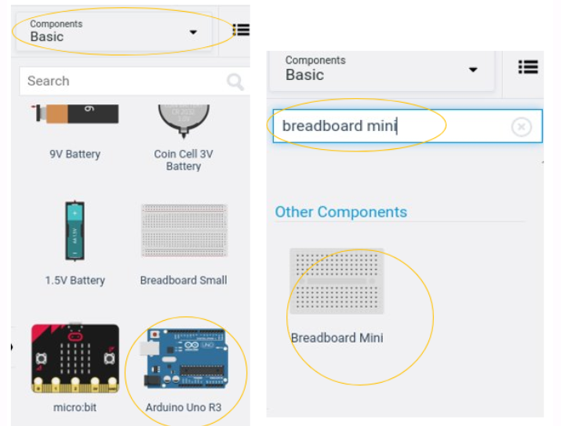
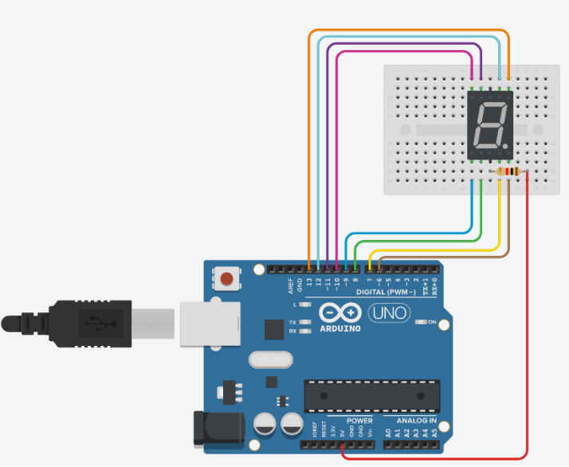
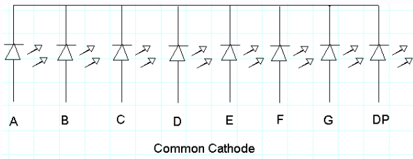
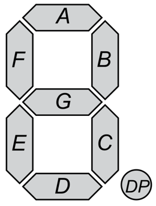

# Introduction
In today’s activity we will use an Arduino to drive  seven segmented display with C/C++ code.

> The primary tool for this project will be TinkerCad -> https://www.tinkercad.com

## Setting up the Circuit

Once loaded login to TinkerCad and then click on \menu{Circuits > Create new Circuit}.

Change the circuit name, located top-left hand side of the screen to **Seven__Segment_Display**.

Next you need to add an Arduino Uno and a breadboard that need to be connected together from the 5V and GND pins of the Arduino to the power and ground rails of the breadboard. 

This can be achieved by either selecting the Arduino Uno and the breadboard from **Components** > **Basic** components or by changing **Components** > **Basic** to **Components** > **Starter** and choosing Arduino Uno and the Breadboard starter. Please refer to image below.

<div align=center>



</div>

You now need to add:
- 1 x 7 Segment Display, **Components** > **Other Components** or alternatively use the search box
- 1 x resistor, set at \\(1k\Omega\\) or \\(1000\Omega\\), **Components** > **Basic** first component in the list.

See below for the circuit set up:

<div align=center>



</div>

## Programming the Circuit

Once you have completed the circuit you will need to programme the Arduino Uno.  Located above the **Components** click the **Code** > **Text**. Once the sketch has appeared reproduce the following code: 

```C++
void setup()
{

}

void loop()
{

}

```

Now you are ready to set up all the Sketch up as follows. 

```C++
int a = 12;
int b = 13;
int c = 7;
int d = 8;
int e = 9;
int f = 11;
int g = 10;
int dp = 6;

void setup()
{

}

void loop()
{

}
```

Firstly the variables are declared and initialised using the `int` keyword.

Lines 1 to 8, define the variables `int a` through to `int g` and then lastly `int dp` which are the pin names for the seven segment display (SSD) component. We have assigned the integers 13 to 6 which are the pins on the Arduino that we are going to use to drive the SSD.

> TODO:
> 
> Add inline comment on line 1 to summaries the description above so that it explains what this section of code is, using the `//` comment symbols.

The `void setup()` will be used to set the pin modes and initialise the serial. 

```C++
void setup()
{
  pinMode(a,OUTPUT);
  pinMode(b,OUTPUT);
  pinMode(c,OUTPUT);
  pinMode(d,OUTPUT);
  pinMode(e,OUTPUT);
  pinMode(f,OUTPUT);
  pinMode(g,OUTPUT);
  pinMode(dp,OUTPUT);
}
```

For each variable (`a` ... `g}`and `dp`) we have to specify how the pin on the Arduino behaves, in this case we are setting them as outputs, `pinMode(a,OUTPUT);`.

> TODO: 
>
> Add inline comment on lines 12 to describe the purpose of this block of code, hint I have mentioned this above, remember `//` are the comment symbols.

The `void loop()`, function contains code that will run forever.

Write out the following code:


```C++
void loop()
{
  digitalWrite(a, HIGH);
  digitalWrite(b, HIGH);
  digitalWrite(c, HIGH);
  digitalWrite(d, HIGH);
  digitalWrite(e, HIGH);
  digitalWrite(f, HIGH);
  digitalWrite(g, HIGH);
  digitalWrite(dp,HIGH);
  delay(1000);                           //
  digitalWrite(a, LOW);
  digitalWrite(b, LOW);
  digitalWrite(c, LOW);
  digitalWrite(d, LOW);
  digitalWrite(e, LOW);
  digitalWrite(f, LOW);
  digitalWrite(g, HIGH);
  delay(1000);                           //
}
```

Notice that to control the pin we use the function `digitalWrite(pinNumber,KEYWORD)`. Pins in the `OUTPUT` mode can only be `HIGH` or `LOW` to represent voltage on or off. We can see that line 24 sets the pin `12` or `a` is set as `HIGH`, this is because we are using the anode setup of the SSD and therefore we use the inverse. See the diagrams for anode and cathode circuity.

<div align=center>




</div>


If you where to run the circuit now you should see after one second the number 0 displayed and then nothing for a second and so forth. This is because we are waiting 1 second before change the pins' output, `delay(1000);` where 1000 is in milliseconds. 

> TODO:
> 
> - Using the image below as reference try to generate 0 - 9 then A,b,C,d,E,F and finally the decimal point(dp). You have the skeleton code do this, copy and paste line 33 to line 40 on line 41 and repeat.

<div align=center>



</div>